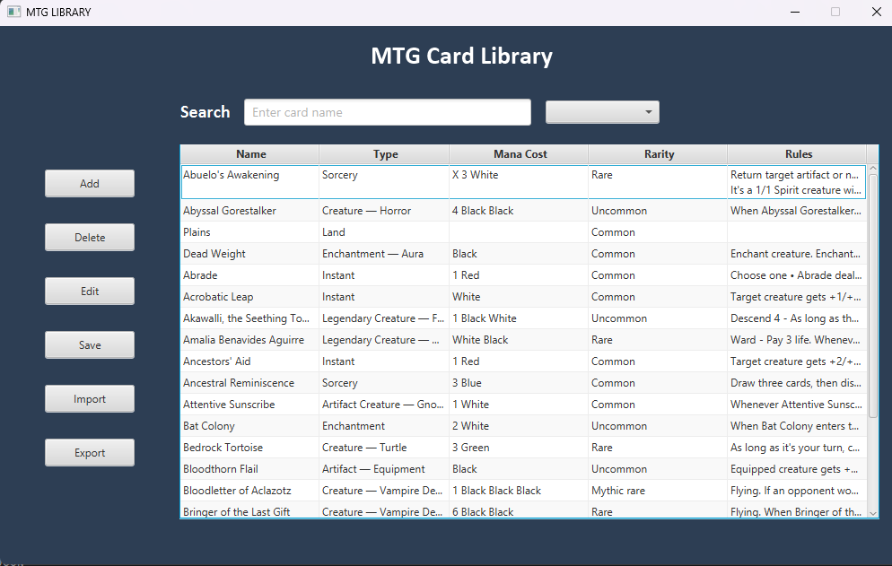

<h2 align="center">MTG Card Library</h2>

Small application I build during studies for semestral project. It is small CRUD app to hold tableview (future database) of cards from Magic The Gathering.
You can add, edit and read all rules and needed info from library. The GUI was made with JavaFX and card container is just a JSON file, which is supported by 
Java Jakcson library.

